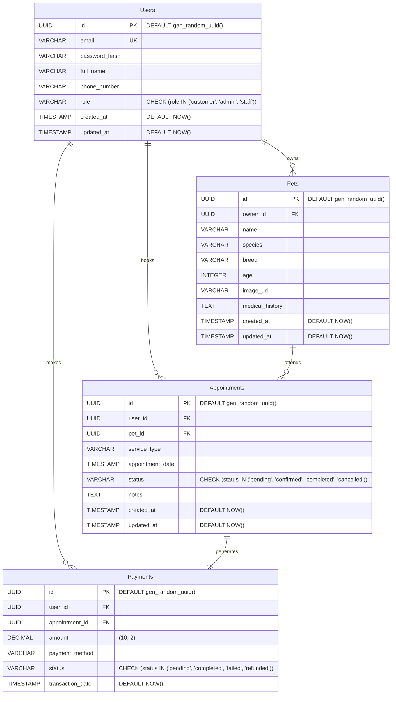

# Database Schema Design (PostgreSQL)

## Entity-Relationship Diagram (ERD)

## Table Definitions

### 1. Users
Stores customer and staff information.

| Column | Type | Constraints | Description |
|---|---|---|---|
| `id` | UUID | PK, Default `gen_random_uuid()` | Unique identifier |
| `email` | VARCHAR(255) | UNIQUE, NOT NULL | User email address |
| `password_hash` | VARCHAR(255) | NOT NULL | Hashed password (e.g., bcrypt) |
| `full_name` | VARCHAR(100) | NOT NULL | User's full name |
| `phone_number` | VARCHAR(20) | | Contact number |
| `role` | VARCHAR(20) | CHECK ('customer', 'admin', 'staff') | Permission level |
| `created_at` | TIMESTAMP | DEFAULT NOW() | Account creation time |

### 2. Pets
Stores information about user's pets.

| Column | Type | Constraints | Description |
|---|---|---|---|
| `id` | UUID | PK, Default `gen_random_uuid()` | Unique identifier |
| `owner_id` | UUID | FK -> `users.id` | Owner of the pet |
| `name` | VARCHAR(100) | NOT NULL | Pet's name |
| `species` | VARCHAR(50) | NOT NULL | e.g., 'Dog', 'Cat' |
| `breed` | VARCHAR(100) | | e.g., 'Golden Retriever' |
| `age` | INTEGER | | Age in years |
| `image_url` | TEXT | | URL to pet's photo |
| `medical_history` | TEXT | | Optional notes on health |

### 3. Appointments
Booking records for services.

| Column | Type | Constraints | Description |
|---|---|---|---|
| `id` | UUID | PK, Default `gen_random_uuid()` | Unique identifier |
| `user_id` | UUID | FK -> `users.id` | User who booked |
| `pet_id` | UUID | FK -> `pets.id` | Pet receiving service |
| `service_type` | VARCHAR(100) | NOT NULL | e.g., 'Grooming', 'Checkup' |
| `appointment_date` | TIMESTAMP | NOT NULL | Scheduled time |
| `status` | VARCHAR(20) | CHECK ('pending', 'confirmed', 'completed', 'cancelled') | Status of booking |
| `notes` | TEXT | | Special requests |

### 4. Payments
Transaction records linked to appointments.

| Column | Type | Constraints | Description |
|---|---|---|---|
| `id` | UUID | PK, Default `gen_random_uuid()` | Unique identifier |
| `user_id` | UUID | FK -> `users.id` | Payer |
| `appointment_id` | UUID | FK -> `appointments.id` | Service being paid for |
| `amount` | DECIMAL(10, 2) | NOT NULL | Cost of service |
| `payment_method` | VARCHAR(50) | | e.g., 'Credit Card', 'Cash' |
| `status` | VARCHAR(20) | CHECK ('pending', 'completed', 'failed') | Payment status |
| `transaction_date` | TIMESTAMP | DEFAULT NOW() | Time of payment |

## Next Steps
1. **Migration**: Create SQL migration scripts (e.g., using Alembic or raw SQL) to initialize this schema.
2. **Models**: Define these schemas in the backend code (Python/Pydantic or SQLAlchemy models).
