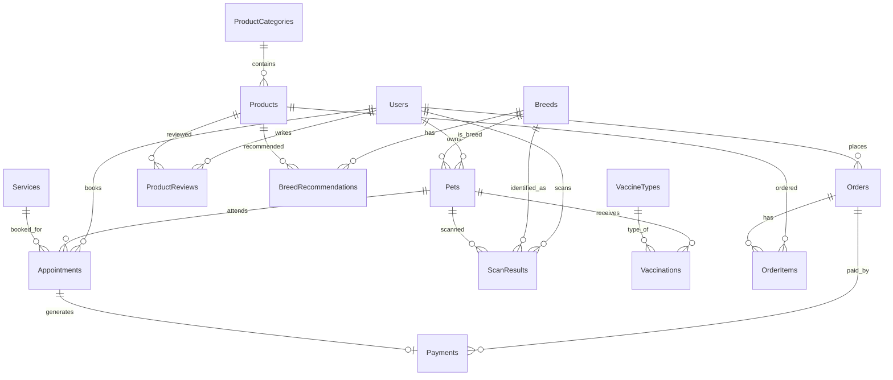

# 🐾 Final Database Schema — Pawsitive Pet Spa (PostgreSQL)

## Decisions Confirmed

| Decision | Answer |
|----------|--------|
| Inventory | Demo only — `stock_quantity` field, no logs |
| Payment | Teammate handles integration — schema ready |
| Cart | localStorage — no DB table |
| Delivery | Both shipping + pickup → `delivery_method` field |
| AI Recommendation | Gemini API + `breed_recommendations` table |

---

## ERD Overview (15 tables)



---

## Proposed Changes

### Group 1: Core Tables

#### [MODIFY] users

```sql
CREATE TABLE users (
    id UUID PRIMARY KEY DEFAULT gen_random_uuid(),
    email VARCHAR(255) UNIQUE NOT NULL,
    password_hash VARCHAR(255) NOT NULL,
    full_name VARCHAR(100) NOT NULL,
    phone_number VARCHAR(20),
    avatar_url TEXT,
    address TEXT,
    role VARCHAR(20) DEFAULT 'customer'
        CHECK (role IN ('customer', 'admin', 'staff')),
    is_active BOOLEAN DEFAULT TRUE,
    created_at TIMESTAMP DEFAULT NOW(),
    updated_at TIMESTAMP DEFAULT NOW()
);
CREATE INDEX idx_users_email ON users(email);
```

#### [MODIFY] pets

```sql
CREATE TABLE pets (
    id UUID PRIMARY KEY DEFAULT gen_random_uuid(),
    owner_id UUID NOT NULL REFERENCES users(id) ON DELETE CASCADE,
    breed_id UUID REFERENCES breeds(id),        -- FK to breeds table
    name VARCHAR(100) NOT NULL,
    species VARCHAR(10) NOT NULL
        CHECK (species IN ('dog', 'cat')),
    breed VARCHAR(100),                          -- Text fallback
    fur_length VARCHAR(20)
        CHECK (fur_length IN ('short', 'medium', 'long', 'hairless')),
    weight DECIMAL(5,2),
    gender VARCHAR(10) CHECK (gender IN ('male', 'female')),
    age INTEGER,
    image_url TEXT,
    medical_history TEXT,
    created_at TIMESTAMP DEFAULT NOW(),
    updated_at TIMESTAMP DEFAULT NOW()
);
CREATE INDEX idx_pets_owner ON pets(owner_id);
```

---

### Group 2: AI & Breed Recognition

#### [NEW] breeds

```sql
CREATE TABLE breeds (
    id UUID PRIMARY KEY DEFAULT gen_random_uuid(),
    name VARCHAR(100) NOT NULL UNIQUE,       -- 'Shiba_Inu' (matches classes.json)
    display_name VARCHAR(100) NOT NULL,      -- 'Shiba Inu'
    species VARCHAR(10) NOT NULL
        CHECK (species IN ('dog', 'cat')),
    fur_type VARCHAR(20) NOT NULL
        CHECK (fur_type IN ('short', 'medium', 'long', 'hairless')),
    size_category VARCHAR(20)
        CHECK (size_category IN ('small', 'medium', 'large')),
    description TEXT,
    image_url TEXT,
    created_at TIMESTAMP DEFAULT NOW()
);
```

#### [NEW] scan_results

```sql
CREATE TABLE scan_results (
    id UUID PRIMARY KEY DEFAULT gen_random_uuid(),
    user_id UUID REFERENCES users(id),
    pet_id UUID REFERENCES pets(id),
    breed_id UUID REFERENCES breeds(id),
    confidence DECIMAL(5,4) NOT NULL,
    image_url TEXT NOT NULL,
    top_3_predictions JSONB,
    created_at TIMESTAMP DEFAULT NOW()
);
CREATE INDEX idx_scan_user ON scan_results(user_id);
```

#### [NEW] breed_recommendations

```sql
CREATE TABLE breed_recommendations (
    id UUID PRIMARY KEY DEFAULT gen_random_uuid(),
    breed_id UUID NOT NULL REFERENCES breeds(id),
    product_id UUID REFERENCES products(id),
    service_id UUID REFERENCES services(id),
    recommendation_type VARCHAR(20) NOT NULL
        CHECK (recommendation_type IN ('food', 'toy', 'clothing', 'cage', 'grooming', 'vaccine', 'hygiene')),
    recommendation_reason TEXT,
    priority INTEGER DEFAULT 0,
    UNIQUE(breed_id, product_id),
    CHECK (
        (product_id IS NOT NULL AND service_id IS NULL) OR
        (product_id IS NULL AND service_id IS NOT NULL)
    )
);
```

---

### Group 3: Products

#### [NEW] product_categories

```sql
CREATE TABLE product_categories (
    id UUID PRIMARY KEY DEFAULT gen_random_uuid(),
    name VARCHAR(100) NOT NULL,
    slug VARCHAR(100) UNIQUE NOT NULL,
    icon VARCHAR(50),
    description TEXT,
    display_order INTEGER DEFAULT 0
);
```

#### [NEW] products

```sql
CREATE TABLE products (
    id UUID PRIMARY KEY DEFAULT gen_random_uuid(),
    category_id UUID REFERENCES product_categories(id),
    name VARCHAR(255) NOT NULL,
    slug VARCHAR(255) UNIQUE NOT NULL,
    description TEXT,
    price DECIMAL(12,2) NOT NULL,
    sale_price DECIMAL(12,2),
    stock_quantity INTEGER DEFAULT 0,
    sku VARCHAR(50) UNIQUE,
    image_url TEXT,
    images JSONB DEFAULT '[]',
    target_species VARCHAR(20) CHECK (target_species IN ('dog', 'cat', 'both')),
    target_fur_type VARCHAR(20) CHECK (target_fur_type IN ('short', 'long', 'all')),
    target_size VARCHAR(20) CHECK (target_size IN ('small', 'medium', 'large', 'all')),
    is_active BOOLEAN DEFAULT TRUE,
    rating_avg DECIMAL(3,2) DEFAULT 0,
    rating_count INTEGER DEFAULT 0,
    created_at TIMESTAMP DEFAULT NOW(),
    updated_at TIMESTAMP DEFAULT NOW()
);
CREATE INDEX idx_products_category ON products(category_id);
CREATE INDEX idx_products_species ON products(target_species);
```

#### [NEW] product_reviews

```sql
CREATE TABLE product_reviews (
    id UUID PRIMARY KEY DEFAULT gen_random_uuid(),
    product_id UUID NOT NULL REFERENCES products(id) ON DELETE CASCADE,
    user_id NOT NULL REFERENCES users(id),
    rating INTEGER NOT NULL CHECK (rating BETWEEN 1 AND 5),
    comment TEXT,
    created_at TIMESTAMP DEFAULT NOW(),
    UNIQUE(product_id, user_id)
);
```

---

### Group 4: Orders

#### [NEW] orders

```sql
CREATE TABLE orders (
    id UUID PRIMARY KEY DEFAULT gen_random_uuid(),
    user_id UUID NOT NULL REFERENCES users(id),
    order_number VARCHAR(20) UNIQUE NOT NULL,
    total_amount DECIMAL(12,2) NOT NULL,
    delivery_method VARCHAR(20) DEFAULT 'pickup'
        CHECK (delivery_method IN ('pickup', 'shipping')),
    shipping_address TEXT,                       -- Required if shipping
    shipping_fee DECIMAL(12,2) DEFAULT 0,
    receiver_name VARCHAR(100),
    receiver_phone VARCHAR(20),
    status VARCHAR(20) DEFAULT 'pending'
        CHECK (status IN ('pending','confirmed','processing','shipping','delivered','cancelled')),
    notes TEXT,
    created_at TIMESTAMP DEFAULT NOW(),
    updated_at TIMESTAMP DEFAULT NOW()
);
CREATE INDEX idx_orders_user ON orders(user_id);
CREATE INDEX idx_orders_status ON orders(status);
```

#### [NEW] order_items

```sql
CREATE TABLE order_items (
    id UUID PRIMARY KEY DEFAULT gen_random_uuid(),
    order_id UUID NOT NULL REFERENCES orders(id) ON DELETE CASCADE,
    product_id UUID NOT NULL REFERENCES products(id),
    quantity INTEGER NOT NULL CHECK (quantity > 0),
    unit_price DECIMAL(12,2) NOT NULL,
    subtotal DECIMAL(12,2) NOT NULL
);
```

---

### Group 5: Services & Vaccinations

#### [NEW] services

```sql
CREATE TABLE services (
    id UUID PRIMARY KEY DEFAULT gen_random_uuid(),
    name VARCHAR(100) NOT NULL,
    description TEXT,
    price DECIMAL(12,2) NOT NULL,
    duration_minutes INTEGER,
    target_species VARCHAR(20) CHECK (target_species IN ('dog', 'cat', 'both')),
    is_active BOOLEAN DEFAULT TRUE,
    image_url TEXT,
    created_at TIMESTAMP DEFAULT NOW()
);
```

#### [MODIFY] appointments

```sql
CREATE TABLE appointments (
    id UUID PRIMARY KEY DEFAULT gen_random_uuid(),
    user_id UUID NOT NULL REFERENCES users(id),
    pet_id UUID NOT NULL REFERENCES pets(id),
    service_id UUID REFERENCES services(id),    -- FK thay vì text service_type
    appointment_date TIMESTAMP NOT NULL,
    status VARCHAR(20) DEFAULT 'pending'
        CHECK (status IN ('pending','confirmed','completed','cancelled')),
    notes TEXT,
    created_at TIMESTAMP DEFAULT NOW(),
    updated_at TIMESTAMP DEFAULT NOW()
);
CREATE INDEX idx_appointments_date ON appointments(appointment_date);
CREATE INDEX idx_appointments_user ON appointments(user_id);
```

#### [NEW] vaccine_types

```sql
CREATE TABLE vaccine_types (
    id UUID PRIMARY KEY DEFAULT gen_random_uuid(),
    name VARCHAR(100) NOT NULL,
    target_species VARCHAR(10) CHECK (target_species IN ('dog', 'cat')),
    description TEXT,
    recommended_age_months INTEGER,
    interval_days INTEGER,
    doses_required INTEGER DEFAULT 1
);
```

#### [NEW] vaccinations

```sql
CREATE TABLE vaccinations (
    id UUID PRIMARY KEY DEFAULT gen_random_uuid(),
    pet_id UUID NOT NULL REFERENCES pets(id),
    vaccine_type_id UUID NOT NULL REFERENCES vaccine_types(id),
    administered_by UUID REFERENCES users(id),
    dose_number INTEGER DEFAULT 1,
    vaccination_date DATE NOT NULL,
    next_due_date DATE,
    batch_number VARCHAR(50),
    notes TEXT,
    status VARCHAR(20) DEFAULT 'completed'
        CHECK (status IN ('scheduled','completed','missed','cancelled')),
    created_at TIMESTAMP DEFAULT NOW()
);
CREATE INDEX idx_vaccinations_pet ON vaccinations(pet_id);
```

---

### Group 6: Payments

#### [MODIFY] payments

```sql
CREATE TABLE payments (
    id UUID PRIMARY KEY DEFAULT gen_random_uuid(),
    user_id UUID NOT NULL REFERENCES users(id),
    appointment_id UUID REFERENCES appointments(id),
    order_id UUID REFERENCES orders(id),
    payment_type VARCHAR(20) NOT NULL
        CHECK (payment_type IN ('appointment', 'order')),
    amount DECIMAL(12,2) NOT NULL,
    payment_method VARCHAR(50),              -- 'cod', 'momo', 'vnpay', 'bank_transfer'
    status VARCHAR(20) DEFAULT 'pending'
        CHECK (status IN ('pending','completed','failed','refunded')),
    transaction_id VARCHAR(100),             -- External payment ref
    transaction_date TIMESTAMP DEFAULT NOW(),
    CHECK (
        (appointment_id IS NOT NULL AND order_id IS NULL) OR
        (appointment_id IS NULL AND order_id IS NOT NULL)
    )
);
```

---

## 🐕 Breed Seed Data — 37 Giống (Oxford-IIIT)

### Dogs (25 giống)

| # | name (classes.json) | display_name | fur_type | size |
|---|---------------------|-------------|----------|------|
| 1 | American_Bulldog | American Bulldog | short | large |
| 2 | American_Pit_Bull_Terrier | American Pit Bull Terrier | short | medium |
| 3 | Basset_Hound | Basset Hound | short | medium |
| 4 | Beagle | Beagle | short | medium |
| 5 | Boxer | Boxer | short | large |
| 6 | Chihuahua | Chihuahua | short | small |
| 7 | English_Cocker_Spaniel | English Cocker Spaniel | long | medium |
| 8 | English_Setter | English Setter | long | large |
| 9 | German_Shorthaired | German Shorthaired Pointer | short | large |
| 10 | Great_Pyrenees | Great Pyrenees | long | large |
| 11 | Havanese | Havanese | long | small |
| 12 | Japanese_Chin | Japanese Chin | long | small |
| 13 | Keeshond | Keeshond | long | medium |
| 14 | Leonberger | Leonberger | long | large |
| 15 | Miniature_Pinscher | Miniature Pinscher | short | small |
| 16 | Newfoundland | Newfoundland | long | large |
| 17 | Pomeranian | Pomeranian | long | small |
| 18 | Pug | Pug | short | small |
| 19 | Saint_Bernard | Saint Bernard | long | large |
| 20 | Samoyed | Samoyed | long | large |
| 21 | Scottish_Terrier | Scottish Terrier | long | small |
| 22 | Shiba_Inu | Shiba Inu | medium | medium |
| 23 | Staffordshire_Bull_Terrier | Staffordshire Bull Terrier | short | medium |
| 24 | Wheaten_Terrier | Wheaten Terrier | long | medium |
| 25 | Yorkshire_Terrier | Yorkshire Terrier | long | small |

### Cats (12 giống)

| # | name (classes.json) | display_name | fur_type | size |
|---|---------------------|-------------|----------|------|
| 1 | Abyssinian | Abyssinian | short | medium |
| 2 | Bengal | Bengal | short | medium |
| 3 | Birman | Birman | long | medium |
| 4 | Bombay | Bombay | short | medium |
| 5 | British_Shorthair | British Shorthair | short | medium |
| 6 | Egyptian_Mau | Egyptian Mau | short | medium |
| 7 | Maine_Coon | Maine Coon | long | large |
| 8 | Persian | Persian | long | medium |
| 9 | Ragdoll | Ragdoll | long | large |
| 10 | Russian_Blue | Russian Blue | short | medium |
| 11 | Siamese | Siamese | short | medium |
| 12 | Sphynx | Sphynx | hairless | medium |

---

## 🤖 AI Recommendation Logic

### Flow: Scan → Breed → Recommendations

```
1. User upload ảnh → TF.js predict → breed_id (top 1)
2. Query breeds → species, fur_type, size_category
3. Gọi Gemini API với context:
   - "Giống: {breed}, Species: {species}, Lông: {fur_type}, Size: {size}"
   - "Gợi ý sản phẩm phù hợp từ danh mục: thức ăn, đồ chơi, áo quần, chuồng"
4. Kết hợp với breed_recommendations (static) + Gemini response (dynamic)
5. Trả về danh sách sản phẩm + lý do gợi ý
```

### Recommendation Matrix (Seed rules)

| Thuộc tính | Gợi ý |
|------------|-------|
| **Lông dài** (long) | Dịch vụ cắt tỉa lông, dầu gội lông dài, bàn chải gỡ rối, áo chống rụng lông |
| **Lông ngắn** (short) | Dầu gội dưỡng lông mượt, găng tay massage, áo giữ ấm mùa đông |
| **Không lông** (hairless) | Kem chống nắng, áo bảo vệ da, dầu dưỡng da |
| **Size nhỏ** (small) | Thức ăn hạt nhỏ, đồ chơi mini, chuồng size S, áo size XS-S |
| **Size lớn** (large) | Thức ăn hạt lớn high-protein, đồ chơi bền, chuồng size XL, dây dắt chắc |
| **Chó** (dog) | Vaccine 5-in-1, thuốc tẩy giun, dây dắt, bát ăn chống nghẹn |
| **Mèo** (cat) | Vaccine 3-in-1, cát vệ sinh, trụ cào móng, đồ chơi chuột |
